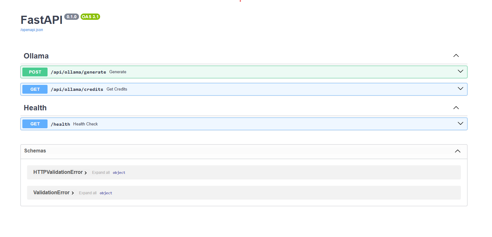

# FastAPI Ollama Demo

## Overview

This project demonstrates the integration of Large Language Models (LLMs) using Ollama with FastAPI. It showcases how to build and deploy AI-powered applications efficiently.

## Preview



## Prerequisites

Ensure you have the following installed:

- [Python] (https://www.python.org/) (Python 3.8+)
- [Ollama] (https://ollama.com/) (for LLMs)
- [UV] (https://docs.astral.sh/uv/) (for dependency management)

## Local Development Setup

### 1. Clone the Repository

```bash
git clone https://github.com/deyrahul95/fastapi-ollama-demo.git
cd fastapi-ollama-demo
```

### 2. Set Up the Virtual Environment
```bash
uv install
```

### 3. Configure Environment Variables
Create a .env file in the root directory and add the following:

```
OLLAMA_API_URL=http://localhost:11434
OLLAMA_MODEL_ID=gemma3:1b
API_KEY=<secret api key>
```

Ensure Ollama is running locally on the specified URL.

### 4. Run the FastAPI Server

activate the virtual env (for ubuntu)

```bash
source .venv/bin/activate
```

then run the following command

```bash
fastapi dev src/main.py 
```

The application will be accessible at http://127.0.0.1:8000.

### 5. Access the OpenAPI Documentation
Open your browser and navigate to: http://127.0.0.1:8000/docs